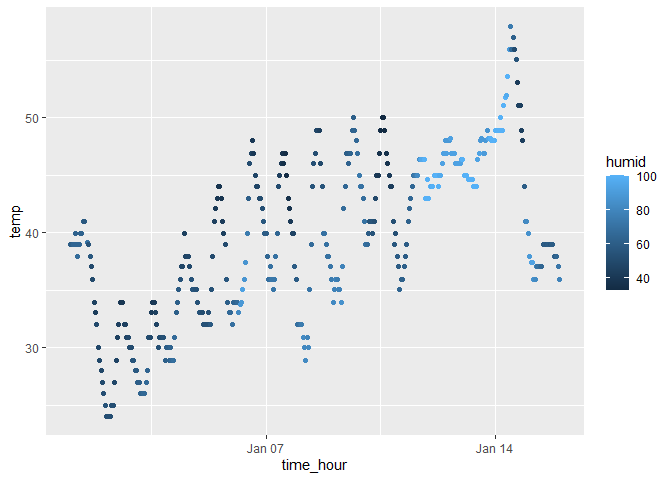

p8105_hw1_sz3213
================
Sitian Zhou
2023-09-16

# Problem 1

The dataset `early_january_weather` consists of 358 rows and 15
variables. This dataset includes various essential variables measured at
EWR weather station from January 1st to January 15th in 2013: `temp` and
`dewp` for temperature and dew point, `humid` for the relative humidity,
`wind_dir`, `wind_speed`, `wind_gust` for wind direction, speed and gust
speed, respectively. Additionally, `precip`, `pressure`, and `visib`
represent precipitation, sea level pressure, and visibility. The mean
temperature in Fahrenheit is 39.5821229.

<!-- -->

According to the scatter plot, the temperature from January 1st to
January 15th is generally showing an upward trend. Additonally, the
daily temperature fluctuation tends to be smaller when humidity is close
to 100 (Jan 13th - Jan 14th) compared to the rest of the day when
humidity is around 50.

# Problem 2

When taking mean values for the 4 variables, the numerical and logical
vectors returned numerical results, while the character vector and the
factor vector returned NA.

``` r
# convert the logical, character, and factor variables to numerical values
as.numeric(pull(mydata, vec_logical))
as.numeric(pull(mydata, vec_char))
as.numeric(pull(mydata, vec_factor))
```

The logical and factor vectors can be converted to numerical values
while the character vector cannot, which implies they are stored in R as
some numerical values. This explains why we can take the mean value of
the logical vector directly. The factor vector is initially represented
as character values in the dataset, making it unsuitable for direct mean
calculation, but after applying `as.numeric` to it, we can successfully
transform it into numerical values, enabling subsequent mean
calculations.
